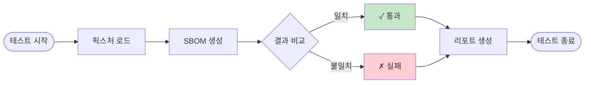

# SBOM Tools

🇰🇷 한국어 | [🇺🇸 English](README.md)

> 소프트웨어 공급망 보안을 위한 SBOM(Software Bill of Materials) 생성 도구

[](https://github.com/sktelecom/sbom-tools/releases)
[](https://github.com/sktelecom/sbom-tools/pkgs/container/sbom-scanner)
[](LICENSE)
[](https://github.com/sktelecom/sbom-tools/stargazers)

## 목차

- [개요](#개요)
- [프로젝트 구조](#프로젝트-구조)
- [아키텍처](#아키텍처)
- [빠른 시작](#빠른-시작)
- [사용 예시](#사용-예시)
- [고급 사용법](#고급-사용법)
- [문서](#문서)
- [기여하기](#기여하기)
- [라이선스](#라이선스)

## 개요

SBOM Tools는 다양한 프로그래밍 언어와 환경에서 자동으로 SBOM을 생성하는 도구입니다. SK텔레콤이 공급망 보안 강화를 위해 개발하여 오픈소스로 공개하였습니다.

### 주요 기능

* 다중 언어 지원: Java, Python, Node.js, Ruby, PHP, Rust, Go, .NET, C/C++
* 다양한 분석 대상: 소스 코드, Docker 이미지, 바이너리 파일, RootFS
* 표준 포맷: CycloneDX 1.4 형식의 SBOM 생성
* Docker 기반: 언어별 런타임 설치 불필요
* 멀티 플랫폼: Linux (AMD64, ARM64), macOS 지원

### 지원 언어

| 언어 | 패키지 매니저 | 지원 버전 |
| --- | --- | --- |
| Java | Maven, Gradle | Java 7-17 (JDK 17) |
| Python | pip, Poetry, Pipenv | Python 3.6+ |
| Node.js | npm, Yarn, pnpm | Node.js 14+ |
| Ruby | Bundler | Ruby 2.x, 3.x |
| PHP | Composer | PHP 7.x, 8.x |
| Rust | Cargo | Rust 1.x |
| Go | Go modules | Go 1.16+ |
| .NET | NuGet | .NET Core, .NET 5+ |
| C/C++ | Conan, vcpkg | - |

> 참고: Docker 이미지에는 JDK 17이 포함되어 있어 Java 7-17로 빌드된 프로젝트 분석을 지원합니다. Java 21 프로젝트나 Python 2.x 레거시 프로젝트는 [사용 가이드](docs/usage-guide.md)를 참조하세요.

## 프로젝트 구조

```
sbom-tools/
├── .github/
│   └── workflows/          # GitHub Actions 워크플로우
│       ├── docker-build.yml
│       └── release.yml
├── docker/
│   ├── Dockerfile          # SBOM 스캐너 Docker 이미지
│   ├── entrypoint.sh       # 컨테이너 진입점 스크립트
│   └── README.md           # Docker 이미지 빌드 가이드
├── docs/
│   ├── getting-started.md  # 시작 가이드
│   ├── usage-guide.md      # 사용법 가이드
│   ├── architecture.md     # 아키텍처 문서 (신규)
│   └── contributing-guide.md # 기여자 가이드 (신규)
├── examples/
│   ├── java-maven/         # Java Maven 프로젝트 예제
│   ├── python-pip/         # Python pip 프로젝트 예제
│   ├── nodejs-npm/         # Node.js npm 프로젝트 예제
│   └── docker-image/       # Docker 이미지 분석 예제
├── scripts/
│   ├── scan-sbom.sh        # Linux/macOS 실행 스크립트
│   ├── scan-sbom.bat       # Windows 실행 스크립트
│   └── utils/              # 유틸리티 스크립트
├── tests/
│   ├── test-scan.sh        # 통합 테스트 스크립트
│   ├── fixtures/           # 테스트 픽스처
│   └── expected/           # 예상 출력 결과
├── CONTRIBUTING.md         # 기여 가이드
├── README.md               # 영문 README
├── README.ko.md            # 한글 README
└── LICENSE                 # Apache 2.0 라이선스
```

### 주요 디렉토리 설명

#### `/docker`
Docker 이미지 빌드와 관련된 모든 파일이 포함되어 있습니다.
- `Dockerfile`: 멀티 스테이지 빌드를 사용하여 최적화된 이미지 생성
- `entrypoint.sh`: SBOM 생성 로직의 핵심 스크립트

#### `/scripts`
사용자가 직접 실행하는 스크립트입니다.
- `scan-sbom.sh`: Docker를 사용하여 SBOM을 생성하는 래퍼 스크립트
- `scan-sbom.bat`: Windows 사용자를 위한 배치 스크립트

#### `/examples`
각 언어별 샘플 프로젝트와 사용 예제가 포함되어 있습니다. 자세한 내용은 [examples 활용 가이드](#examples-활용-가이드)를 참조하세요.

#### `/tests`
자동화된 테스트 스크립트와 테스트 케이스가 포함되어 있습니다. 자세한 내용은 [테스트 가이드](#테스트-추가)를 참조하세요.

## 빠른 시작

### 1. 사전 요구사항

* Docker: 20.10 이상 ([설치 가이드](https://docs.docker.com/get-docker/))

```bash
# Docker 설치 확인
docker --version
```

### 2. 스크립트 다운로드

```bash
# 스크립트 다운로드
curl -O https://raw.githubusercontent.com/sktelecom/sbom-tools/main/scripts/scan-sbom.sh
chmod +x scan-sbom.sh
```

### 3. SBOM 생성

```bash
# 현재 디렉토리의 소스 코드 분석
cd /path/to/your/project
./scan-sbom.sh --project "MyApp" --version "1.0.0" --generate-only
```

결과: `MyApp_1.0.0_bom.json` 파일 생성

## 사용 예시

### 소스 코드 분석

```bash
# Java Maven 프로젝트
cd my-java-app
scan-sbom.sh --project "JavaApp" --version "1.0.0" --generate-only

# Python 프로젝트
cd my-python-app
scan-sbom.sh --project "PythonApp" --version "1.0.0" --generate-only

# Node.js 프로젝트
cd my-nodejs-app
scan-sbom.sh --project "NodeApp" --version "1.0.0" --generate-only
```

### Docker 이미지 분석

```bash
# 로컬 이미지 분석
scan-sbom.sh --target "myapp:latest" --project "MyApp" --version "1.0" --generate-only

# 레지스트리 이미지 분석
scan-sbom.sh --target "nginx:alpine" --project "Nginx" --version "alpine" --generate-only
```

### 바이너리/펌웨어 분석

```bash
# 펌웨어 파일 분석
scan-sbom.sh --target firmware.bin --project "RouterOS" --version "2.0" --generate-only

# RootFS 디렉토리 분석
scan-sbom.sh --target ./rootfs/ --project "DeviceOS" --version "1.0" --generate-only
```

## 고급 사용법

### Docker 이미지 버전 관리

기본적으로 스크립트는 `latest` Docker 이미지를 사용합니다. 프로덕션 환경에서는 특정 버전을 고정할 수 있습니다:

```bash
# 최신 릴리스 사용 (기본값)
./scan-sbom.sh --project "MyApp" --version "1.0.0" --generate-only

# v1 패밀리 고정 (최신 v1.x.x)
SBOM_SCANNER_IMAGE=ghcr.io/sktelecom/sbom-scanner:v1 \
  ./scan-sbom.sh --project "MyApp" --version "1.0.0" --generate-only

# 정확한 버전 고정 (프로덕션)
SBOM_SCANNER_IMAGE=ghcr.io/sktelecom/sbom-scanner:v1.0.0 \
  ./scan-sbom.sh --project "MyApp" --version "1.0.0" --generate-only
```

버전 전략:

* `latest` - 항상 최신 기능 사용 (개발 환경 권장)
* `v1` - 최신 v1.x.x 릴리스 (CI/CD 권장)
* `v1.0` - 최신 v1.0.x 패치 (안정적인 프로덕션 권장)
* `v1.0.0` - 정확한 버전 (최대 안정성)

### Windows 사용

```cmd
REM 스크립트 다운로드
curl -O https://raw.githubusercontent.com/sktelecom/sbom-tools/main/scripts/scan-sbom.bat

REM 기본 사용
scan-sbom.bat --project "MyApp" --version "1.0.0" --generate-only

REM 특정 버전 고정
set SBOM_SCANNER_IMAGE=ghcr.io/sktelecom/sbom-scanner:v1
scan-sbom.bat --project "MyApp" --version "1.0.0" --generate-only
```

## examples 활용 가이드

`examples` 디렉토리에는 각 언어별 샘플 프로젝트가 포함되어 있어 SBOM 생성을 직접 테스트해볼 수 있습니다.

### 디렉토리 구조

```
examples/
├── java-maven/
│   ├── pom.xml
│   ├── src/
│   └── README.md
├── python-pip/
│   ├── requirements.txt
│   ├── app.py
│   └── README.md
├── nodejs-npm/
│   ├── package.json
│   ├── index.js
│   └── README.md
└── docker-image/
    ├── Dockerfile
    └── README.md
```

### 예제 실행 방법

#### 1. Java Maven 프로젝트

```bash
cd examples/java-maven
../../scripts/scan-sbom.sh --project "JavaExample" --version "1.0.0" --generate-only

# 생성된 SBOM 확인
cat JavaExample_1.0.0_bom.json | jq '.components[] | {name, version}'
```

#### 2. Python pip 프로젝트

```bash
cd examples/python-pip
../../scripts/scan-sbom.sh --project "PythonExample" --version "1.0.0" --generate-only

# Flask, requests 등의 의존성 확인
cat PythonExample_1.0.0_bom.json | jq '.components[] | select(.name | contains("flask"))'
```

#### 3. Node.js npm 프로젝트

```bash
cd examples/nodejs-npm
../../scripts/scan-sbom.sh --project "NodeExample" --version "1.0.0" --generate-only

# express 의존성 트리 확인
cat NodeExample_1.0.0_bom.json | jq '.dependencies'
```

#### 4. Docker 이미지

```bash
cd examples/docker-image

# 이미지 빌드
docker build -t example-app:1.0 .

# SBOM 생성
../../scripts/scan-sbom.sh --target "example-app:1.0" --project "DockerExample" --version "1.0.0" --generate-only

# OS 패키지 확인
cat DockerExample_1.0.0_bom.json | jq '.components[] | select(.type == "operating-system")'
```

### 예제 커스터마이징

각 예제 디렉토리의 `README.md` 파일에는 다음 내용이 포함되어 있습니다:

- 프로젝트 설명
- 의존성 추가/제거 방법
- SBOM 결과 해석 방법
- 일반적인 문제 해결

## 테스트 추가

### 테스트 구조

```
tests/
├── test-scan.sh           # 메인 테스트 스크립트
├── fixtures/              # 테스트용 샘플 프로젝트
│   ├── java-simple/
│   ├── python-simple/
│   └── node-simple/
└── expected/              # 예상 출력 결과
    ├── java-simple.json
    ├── python-simple.json
    └── node-simple.json
```

### 테스트 실행

```bash
# 전체 테스트 실행
cd tests
./test-scan.sh

# 특정 언어만 테스트
./test-scan.sh java
./test-scan.sh python
./test-scan.sh nodejs

# 상세 로그와 함께 실행
./test-scan.sh --verbose
```

### 테스트 스크립트 작동 방식



### 새 테스트 추가하기

1. 픽스처 생성
   ```bash
   mkdir -p tests/fixtures/my-test-case
   # 테스트할 프로젝트 파일 추가
   ```

2. 예상 결과 생성
   ```bash
   # SBOM 생성
   ./scripts/scan-sbom.sh --project "MyTest" --version "1.0" --generate-only
   
   # 검증 후 예상 결과로 저장
   cp MyTest_1.0_bom.json tests/expected/my-test-case.json
   ```

3. 테스트 케이스 추가
   `tests/test-scan.sh`에 새 테스트 케이스를 추가합니다:
   ```bash
   test_my_case() {
       echo "Testing my-test-case..."
       run_scan "my-test-case" "MyTest" "1.0"
       compare_results "my-test-case"
   }
   ```

### CI/CD 통합

GitHub Actions를 통해 자동으로 테스트를 실행합니다:

```yaml
# .github/workflows/test.yml
name: Test
on: [push, pull_request]
jobs:
  test:
    runs-on: ubuntu-latest
    steps:
      - uses: actions/checkout@v3
      - name: Run tests
        run: |
          chmod +x tests/test-scan.sh
          cd tests && ./test-scan.sh
```

## 문서

* [시작 가이드](docs/getting-started.md): 상세한 설치 및 첫 사용 가이드 (한국어)
* [사용법 가이드](docs/usage-guide.md): 언어별 사용법 및 고급 기능 (한국어)
* [아키텍처 가이드](docs/architecture.md): 시스템 아키텍처 상세 설명 (한국어)
* [기여자 가이드](docs/contributing-guide.md): 새로운 패키지 매니저 지원 추가 방법 (한국어)
* [Docker 이미지](docker/README.md): Docker 이미지 빌드 및 배포 (한국어)

## 기여하기

기여를 환영합니다! [기여 가이드라인](CONTRIBUTING.md)을 참조해주세요.

### 이슈 보고

버그 리포트나 기능 제안은 [GitHub Issues](https://github.com/sktelecom/sbom-tools/issues)를 통해 제출해주세요.

### Pull Request

1. 저장소를 Fork합니다
2. 기능 브랜치를 생성합니다 (`git checkout -b feature/amazing-feature`)
3. 변경사항을 커밋합니다 (`git commit -m 'Add amazing feature'`)
4. 브랜치에 Push합니다 (`git push origin feature/amazing-feature`)
5. Pull Request를 생성합니다

### 새로운 패키지 매니저 지원 추가

새로운 패키지 매니저 지원을 추가하는 방법은 [기여자 가이드](docs/contributing-guide.md)를 참조하세요.

## 라이선스

Copyright © 2026 SK Telecom Co., Ltd. All Rights Reserved.

이 프로젝트는 [Apache License 2.0](LICENSE)으로 배포됩니다.

```
Licensed under the Apache License, Version 2.0 (the "License");
you may not use this file except in compliance with the License.
You may obtain a copy of the License at

    http://www.apache.org/licenses/LICENSE-2.0

Unless required by applicable law or agreed to in writing, software
distributed under the License is distributed on an "AS IS" BASIS,
WITHOUT WARRANTIES OR CONDITIONS OF ANY KIND, either express or implied.
See the License for the specific language governing permissions and
limitations under the License.
```

## 지원

* 이메일: [opensource@sktelecom.com](mailto:opensource@sktelecom.com)
* 이슈 트래커: [GitHub Issues](https://github.com/sktelecom/sbom-tools/issues)
* 문서: https://sktelecom.github.io/guide/supply-chain/

## 관련 프로젝트

* [CycloneDX](https://cyclonedx.org/) - SBOM 표준 형식
* [cdxgen](https://github.com/CycloneDX/cdxgen) - SBOM 생성 도구
* [Syft](https://github.com/anchore/syft) - 컨테이너 이미지 분석 도구
* [Dependency-Track](https://dependencytrack.org/) - SBOM 분석 플랫폼

## 감사의 말

이 프로젝트는 다음 오픈소스 프로젝트를 사용합니다:

* [CycloneDX cdxgen](https://github.com/CycloneDX/cdxgen) - Apache 2.0
* [Anchore Syft](https://github.com/anchore/syft) - Apache 2.0
* [Aqua Security Trivy](https://github.com/aquasecurity/trivy) - Apache 2.0

---

Made by SK Telecom Open Source Program Office
