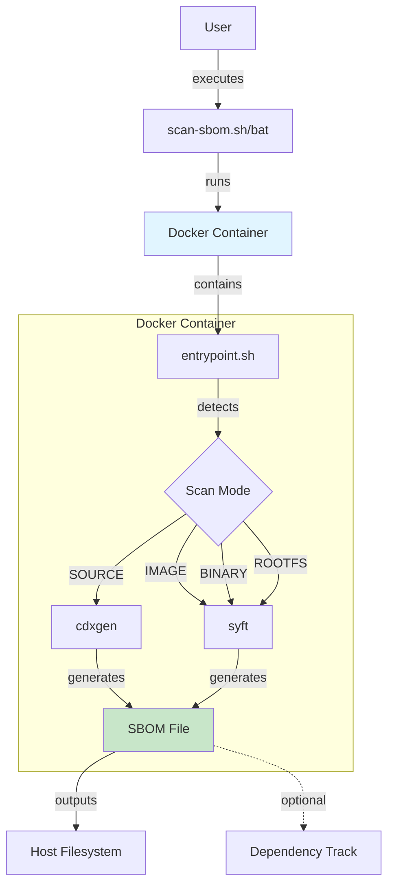
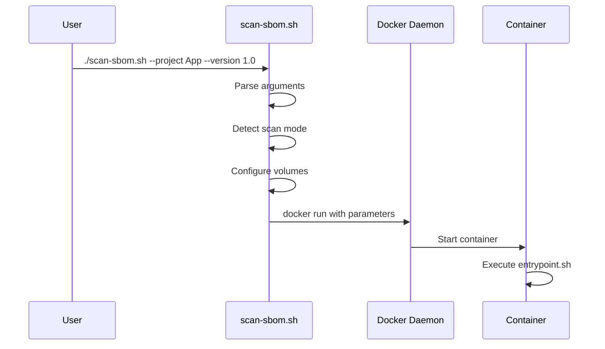
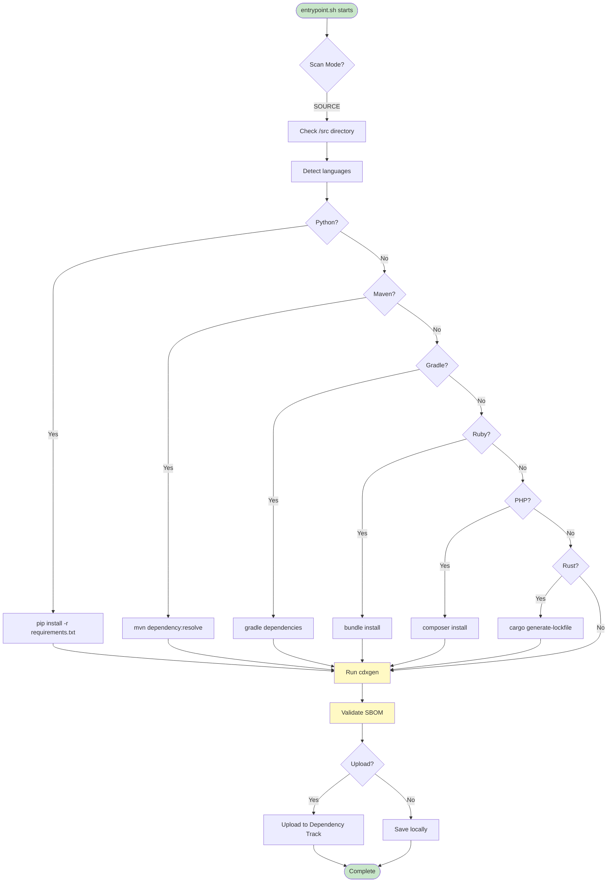
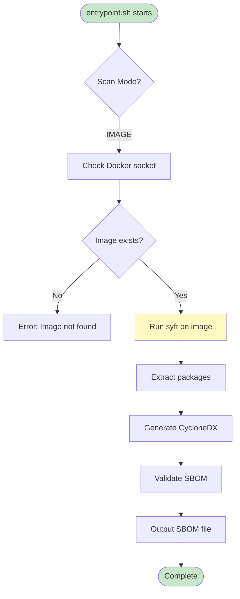

# 아키텍처

> 이 문서는 SBOM Tools의 시스템 아키텍처와 설계를 설명합니다.

# SBOM Tools Architecture

This document describes the architecture, design decisions, and internal structure of the SBOM Tools project.

## Table of Contents

- [Project Structure](#project-structure)
- [Architecture Overview](#architecture-overview)
- [Pipeline Flow](#pipeline-flow)
- [Component Details](#component-details)
- [Extension Points](#extension-points)

## Project Structure

```
sbom-tools/
├── .github/
│   ├── workflows/           # CI/CD automation
│   │   ├── ci.yml          # Integration tests
│   │   ├── docker-publish.yml  # Docker image builds
│   │   └── release.yml     # Release automation
│   └── ISSUE_TEMPLATE/     # Issue templates
├── docker/
│   ├── Dockerfile          # Multi-language runtime
│   ├── entrypoint.sh       # Main execution logic
│   └── README.md           # Docker documentation
├── scripts/
│   ├── scan-sbom.sh        # Linux/macOS wrapper
│   └── scan-sbom.bat       # Windows wrapper
├── examples/               # Sample projects
│   ├── java-maven/
│   ├── nodejs/
│   ├── python/
│   └── docker/
├── tests/
│   └── test-scan.sh        # Integration test suite
└── docs/
    ├── getting-started.md  # User guide
    ├── usage-guide.md      # Detailed usage
    └── examples-guide.md   # Example projects guide
```

### Directory Responsibilities

| Directory | Purpose | Key Files |
|-----------|---------|-----------|
| `.github/` | CI/CD automation | `workflows/*.yml` |
| `docker/` | Container runtime | `Dockerfile`, `entrypoint.sh` |
| `scripts/` | User-facing scripts | `scan-sbom.sh`, `scan-sbom.bat` |
| `examples/` | Sample projects | Language-specific examples |
| `tests/` | Test automation | `test-scan.sh` |
| `docs/` | Documentation | User guides, API docs |

## Architecture Overview



### Key Components

1. **Wrapper Scripts** (`scan-sbom.sh`, `scan-sbom.bat`)
   - Entry point for users
   - Validates Docker environment
   - Configures volume mounts
   - Passes parameters to container

2. **Docker Container**
   - Provides consistent runtime environment
   - Contains all necessary tools (cdxgen, syft, Maven, Gradle, etc.)
   - Isolated execution

3. **Entrypoint Script** (`entrypoint.sh`)
   - Main orchestration logic
   - Mode detection
   - Dependency resolution
   - SBOM generation

4. **SBOM Generators**
   - **cdxgen**: Source code analysis (all languages)
   - **syft**: Container images, binaries, filesystems

## Pipeline Flow

### 1. User Invocation



### 2. Source Code Analysis Flow



### 3. Docker Image Analysis Flow



## Component Details

### 1. entrypoint.sh

**Responsibilities:**
- Environment validation (JAVA_HOME, Python, etc.)
- Mode detection (SOURCE, IMAGE, BINARY, ROOTFS)
- Dependency resolution for each language
- SBOM generation orchestration
- Output handling

**Key Sections:**

```bash
# Environment setup
- Auto-configure JAVA_HOME
- Validate required variables

# Mode execution
case "$SCAN_MODE" in
    SOURCE)  # Source code analysis
    IMAGE)   # Docker image analysis
    BINARY)  # Binary file analysis
    ROOTFS)  # Root filesystem analysis
esac

# Dependency resolution (SOURCE mode)
- Python: pip install
- Java Maven: mvn dependency:resolve
- Java Gradle: gradle dependencies
- Ruby: bundle install
- PHP: composer install
- Rust: cargo generate-lockfile

# SBOM generation
- cdxgen for source code
- syft for images/binaries/rootfs

# Output handling
- Validation
- Upload (optional)
- Local save
```

### 2. Dockerfile

**Multi-stage considerations:**
- Base: `node:20-slim` (Debian)
- JDK 17 (supports Java 7-17)
- Python 3.6+
- Ruby, PHP, Rust runtimes
- Build tools: Maven, Gradle
- SBOM tools: cdxgen, syft

**Optimization:**
- Single JDK version (17) instead of multiple
- Removed Python 2
- Minimal profile for Rust
- Size: ~3-4 GB (optimized from 7.3 GB)

### 3. Wrapper Scripts

**scan-sbom.sh / scan-sbom.bat**

**Responsibilities:**
- Argument parsing
- Mode detection (auto-detect file vs directory vs image)
- Volume mount configuration
- Docker execution

**Key Logic:**

```bash
# Auto-detect mode
if [ -f "$TARGET" ]; then
    MODE="BINARY"
elif [ -d "$TARGET" ]; then
    MODE="ROOTFS"
else
    MODE="IMAGE"
fi

# Configure volumes
SOURCE: -v $(pwd):/src
IMAGE:  -v /var/run/docker.sock:/var/run/docker.sock
BINARY: -v $(dirname $TARGET):/target
ROOTFS: -v $TARGET:/target
```

## Extension Points

### Adding New Package Manager Support

To add support for a new package manager, modify `entrypoint.sh`:

1. **Detect package manager files**
```bash
if [ -f "package-manager-file" ] && command -v tool >/dev/null 2>&1; then
    echo "[INFO] Found package-manager-file. Installing dependencies..."
    tool install-command
fi
```

2. **Add before cdxgen execution**
   - Place in the SOURCE mode section
   - After existing package managers
   - Before `cdxgen` execution

3. **Test with example project**
   - Add to `examples/` directory
   - Add test case to `tests/test-scan.sh`

Example: Adding Go modules support

```bash
# Handle Go modules
if [ -f "go.mod" ] && command -v go >/dev/null 2>&1; then
    echo "[INFO] Found go.mod. Downloading Go modules..."
    go mod download 2>&1 | grep -i error || true
fi
```

See [PACKAGE_MANAGER_GUIDE.md](PACKAGE_MANAGER_GUIDE.md) for detailed instructions.

### Extending Docker Image

To add new language runtimes:

1. **Update Dockerfile**
```dockerfile
# Add new runtime
RUN apt-get update && apt-get install -y --no-install-recommends \
    your-language-runtime \
    && rm -rf /var/lib/apt/lists/*
```

2. **Update entrypoint.sh**
   - Add dependency resolution logic

3. **Update documentation**
   - README.md supported languages table
   - usage-guide.md with examples

4. **Add tests**
   - Example project in `examples/`
   - Test case in `tests/test-scan.sh`

### Custom SBOM Formats

Currently supports CycloneDX 1.4. To add new formats:

1. **Modify cdxgen call in entrypoint.sh**
```bash
# Default: CycloneDX
cdxgen -r -o "$OUTPUT_FILE" .

# Custom format
cdxgen -r -t $FORMAT -o "$OUTPUT_FILE" .
```

2. **Add format parameter to scripts**
   - scan-sbom.sh: add --format option
   - entrypoint.sh: read FORMAT env var

## Design Decisions

### Why Docker-based?

**Pros:**
- Consistent runtime across platforms
- No local tool installation required
- Isolated execution environment
- Easy version management

**Cons:**
- Requires Docker installation
- Larger download size
- Slight performance overhead

**Decision:** Benefits outweigh costs for enterprise use case

### Why cdxgen + syft?

- **cdxgen**: Best for source code, supports 9+ languages
- **syft**: Best for containers, binaries, filesystems
- Complementary tools for comprehensive coverage

### Single JDK Version (17)

**Rationale:**
- JDK 17 can analyze Java 7-17 projects
- Covers 95%+ of use cases
- Reduces image size significantly (1.5 GB saved)

**Trade-off:**
- Java 21 projects may have limitations
- Documented in README as known limitation

## Performance Considerations

### Caching

**Maven/Gradle cache:**
```bash
docker run -v $HOME/.m2:/root/.m2 ...
```

**Benefits:**
- Faster subsequent runs
- Reduced network usage

### Parallel Execution

Currently sequential. Potential improvements:
- Parallel dependency downloads
- Concurrent SBOM generation for multi-project repos

### Resource Limits

Default Docker limits apply. For large projects:

```bash
docker run --memory="4g" --cpus="2" ...
```

## Security Considerations

### Container Security

- Non-root user execution (future improvement)
- Read-only root filesystem (future improvement)
- Minimal base image (node:20-slim)

### Dependency Integrity

- Official package repositories only
- No unofficial mirrors
- HTTPS for all downloads

### Network Isolation

- No network access required for local SBOM generation
- Network only needed for:
  - Dependency downloads
  - Optional upload to Dependency Track

## Monitoring and Debugging

### Log Levels

```bash
[INFO]  - Normal operation
[WARN]  - Non-critical issues
[ERROR] - Failures
```

### Debug Mode

Enable with environment variables:

```bash
docker run -e DEBUG=true ...
```

### Health Checks

Dockerfile includes:
```dockerfile
HEALTHCHECK CMD node --version && java -version
```

## Testing Strategy

See [TESTING_GUIDE.md](TESTING_GUIDE.md) for complete testing documentation.

**Test Pyramid:**
1. Unit tests: Individual script functions
2. Integration tests: Full scan workflows
3. E2E tests: Example projects

**Coverage:**
- 9 language ecosystems
- 4 scan modes
- Error handling scenarios

## Future Enhancements

### Planned Features

1. **SBOM Merging**
   - Combine multiple SBOMs
   - Multi-project repositories

2. **Incremental Scanning**
   - Cache previous results
   - Only scan changed components

3. **SBOM Signing**
   - Digital signatures
   - Verification support

4. **Custom Plugins**
   - User-defined analyzers
   - Plugin architecture

### Performance Optimization

1. **Smaller Base Image**
   - Alpine-based variant
   - Target: < 2 GB

2. **Multi-stage Builds**
   - Build tools in separate stage
   - Runtime-only final image

3. **Language-specific Images**
   - Java-only image
   - Python-only image
   - Smaller, faster downloads

## Contributing

See [CONTRIBUTING.md](CONTRIBUTING.md) for:
- Development setup
- Code style guidelines
- Pull request process
- Testing requirements

## References

- [CycloneDX Specification](https://cyclonedx.org/)
- [cdxgen Documentation](https://github.com/CycloneDX/cdxgen)
- [Syft Documentation](https://github.com/anchore/syft)
- [Dependency Track](https://dependencytrack.org/)
