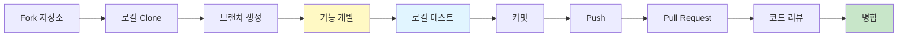
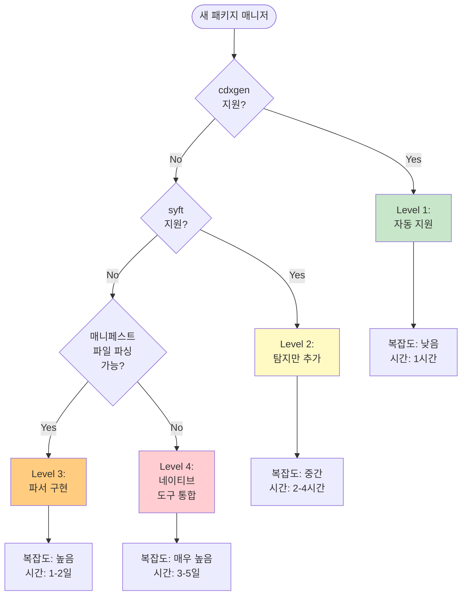

# 기여자 가이드 - 새로운 패키지 매니저 지원 추가

이 가이드는 SBOM Tools에 새로운 패키지 매니저 지원을 추가하는 상세한 방법을 안내합니다.

## 목차

- [시작하기 전에](#시작하기-전에)
- [요구사항 분석](#요구사항-분석)
- [구현 단계](#구현-단계)
- [실전 예제](#실전-예제)
- [테스트 및 검증](#테스트-및-검증)
- [문서화](#문서화)

## 시작하기 전에

### 필수 지식

- Bash 스크립팅: entrypoint.sh 수정을 위해 필요
- JSON 처리: jq를 사용한 SBOM 파싱
- Docker: 컨테이너 환경 이해
- 패키지 매니저: 추가하려는 패키지 매니저에 대한 이해

### 필수 도구

```bash
# 개발 환경 확인
docker --version  # Docker 20.10+
jq --version      # jq 1.6+
git --version     # Git 2.0+
```

### 개발 워크플로우



## 요구사항 분석

### 1. 패키지 매니저 조사

새 패키지 매니저를 추가하기 전에 다음 질문에 답하세요:

#### 기본 정보
- 이름: 무엇인가요?
- 언어/플랫폼: 어떤 언어를 위한 것인가요?
- 공식 웹사이트: URL은?
- 버전: 안정 버전은 무엇인가요?

#### 파일 구조
- 매니페스트 파일: 의존성을 정의하는 파일은?
  - 예: `package.json`, `Cargo.toml`, `composer.json`
- Lock 파일: 정확한 버전을 고정하는 파일은?
  - 예: `package-lock.json`, `Cargo.lock`, `composer.lock`
- 설정 파일: 추가 설정 파일이 있나요?

#### 의존성 정보
- 직접 의존성: 프로젝트가 직접 사용하는 패키지
- 간접 의존성: 의존성의 의존성 (transitive)
- 개발 의존성: 개발 시에만 필요한 패키지
- 버전 범위: 어떻게 표현되나요? (예: `^1.0.0`, `~>2.0`)

### 2. 기존 도구 확인

#### cdxgen 지원 여부

```bash
# cdxgen 지원 목록 확인
docker run --rm cyclonedx/cdxgen:latest --help | grep -A 100 "Supported"
```

cdxgen이 지원한다면 추가 구현이 필요 없습니다!

#### syft 지원 여부

```bash
# syft 지원 목록 확인
docker run --rm anchore/syft:latest packages --help | grep -A 50 "cataloger"
```

### 3. 지원 방식 결정



## 구현 단계

### Level 1: cdxgen 자동 지원

cdxgen이 이미 지원하는 경우 추가 작업이 거의 없습니다.

#### 확인 방법

```bash
# 테스트 프로젝트 준비
cd /path/to/test-project

# cdxgen으로 SBOM 생성 시도
docker run --rm -v $(pwd):/app cyclonedx/cdxgen:latest /app -o /app/test-bom.json

# 결과 확인
cat test-bom.json | jq .
```

#### 필요한 작업

1. 예제 추가
   ```bash
   mkdir -p examples/your-language
   # 샘플 프로젝트 파일 추가
   ```

2. 테스트 추가
   ```bash
   mkdir -p tests/fixtures/your-language-simple
   # 테스트 픽스처 추가
   ```

3. 문서 업데이트
   - README.md에 언어 추가
   - docs/usage-guide.md에 사용 예제 추가

### Level 2: 탐지 로직 추가

syft가 지원하지만 cdxgen이 지원하지 않는 경우.

#### docker/entrypoint.sh 수정

```bash
# 1. 탐지 함수 업데이트
detect_package_manager() {
    local target_dir="$1"
    
    # 새 패키지 매니저 추가 (우선순위 고려)
    if [ -f "${target_dir}/your-lock-file.lock" ]; then
        echo "your-package-manager"
        return 0
    elif [ -f "${target_dir}/your-manifest.file" ]; then
        echo "your-package-manager"
        return 0
    fi
    
    # 기존 로직...
}

# 2. 분석 함수 추가
analyze_with_syft() {
    local target="$1"
    local output="$2"
    local package_manager="$3"
    
    case "${package_manager}" in
        your-package-manager)
            syft packages dir:"${target}" \
                --catalogers your-pm-cataloger \
                -o cyclonedx-json="${output}"
            ;;
        
        # 기존 케이스들...
    esac
}
```

### Level 3: 커스텀 파서 구현

매니페스트 파일을 직접 파싱해야 하는 경우.

#### 파서 구조

```bash
parse_your_package_manager() {
    local manifest_file="$1"
    local output_file="$2"
    
    log "INFO" "Parsing ${manifest_file}..."
    
    # 1. 매니페스트 파일 읽기 및 검증
    if [ ! -f "${manifest_file}" ]; then
        log "ERROR" "Manifest file not found: ${manifest_file}"
        return 1
    fi
    
    # 2. 의존성 추출
    local components=$(extract_dependencies "${manifest_file}")
    
    # 3. CycloneDX 형식으로 변환
    create_cyclonedx_sbom "${components}" "${output_file}"
    
    log "INFO" "SBOM generated: ${output_file}"
}
```

#### 의존성 추출 예제 (JSON 기반)

```bash
extract_dependencies_from_json() {
    local manifest="$1"
    
    # jq를 사용한 파싱
    jq -r '
        .dependencies // {} |
        to_entries[] |
        {
            name: .key,
            version: .value,
            type: "library"
        }
    ' "${manifest}" | jq -s '.'
}
```

#### 의존성 추출 예제 (TOML 기반)

```bash
extract_dependencies_from_toml() {
    local manifest="$1"
    
    # yj (YAML/TOML to JSON)를 사용
    yj -t < "${manifest}" | jq -r '
        .dependencies // {} |
        to_entries[] |
        {
            name: .key,
            version: (.value.version // .value),
            type: "library"
        }
    ' | jq -s '.'
}
```

#### CycloneDX SBOM 생성

```bash
create_cyclonedx_sbom() {
    local components="$1"
    local output="$2"
    
    # 템플릿 사용
    cat > "${output}" <<EOF
{
  "bomFormat": "CycloneDX",
  "specVersion": "1.4",
  "version": 1,
  "metadata": {
    "timestamp": "$(date -u +%Y-%m-%dT%H:%M:%SZ)",
    "component": {
      "type": "application",
      "name": "${PROJECT_NAME}",
      "version": "${PROJECT_VERSION}"
    },
    "tools": [
      {
        "vendor": "SK Telecom",
        "name": "sbom-tools",
        "version": "1.0.0"
      }
    ]
  },
  "components": $(echo "${components}" | jq -c '
    map({
      type: .type,
      name: .name,
      version: .version,
      purl: ("pkg:your-pm/" + .name + "@" + .version)
    })
  ')
}
EOF
}
```

### Level 4: 네이티브 도구 통합

패키지 매니저의 네이티브 CLI를 사용해야 하는 경우.

#### Dockerfile 수정

```dockerfile
# docker/Dockerfile

# 기존 베이스 이미지...

# 새 패키지 매니저 설치
RUN apt-get update && apt-get install -y \
    your-package-manager \
    && rm -rf /var/lib/apt/lists/*

# 또는 직접 다운로드
RUN curl -sL https://your-pm.org/install.sh | bash
```

#### 네이티브 명령 실행

```bash
parse_with_native_tool() {
    local project_dir="$1"
    local output="$2"
    
    cd "${project_dir}" || return 1
    
    # 네이티브 명령으로 의존성 목록 생성
    your-pm list --json > dependencies.json
    
    # JSON을 CycloneDX로 변환
    convert_to_cyclonedx dependencies.json "${output}"
    
    cd - > /dev/null
}

convert_to_cyclonedx() {
    local input="$1"
    local output="$2"
    
    jq '{
        bomFormat: "CycloneDX",
        specVersion: "1.4",
        version: 1,
        components: [
            .[] | {
                type: "library",
                name: .name,
                version: .version,
                purl: ("pkg:your-pm/" + .name + "@" + .version)
            }
        ]
    }' "${input}" > "${output}"
}
```

## 실전 예제

### 예제 1: Elixir Mix (Level 2)

Mix는 Elixir의 빌드 도구입니다. syft가 기본적으로 지원하지만 탐지 로직을 추가해야 합니다.

#### 1. 탐지 로직 추가

```bash
# docker/entrypoint.sh

detect_package_manager() {
    local target_dir="$1"
    
    # Elixir Mix
    if [ -f "${target_dir}/mix.lock" ]; then
        echo "mix"
        return 0
    elif [ -f "${target_dir}/mix.exs" ]; then
        echo "mix"
        return 0
    fi
    
    # ... 기존 로직
}
```

#### 2. 분석 로직 (syft 사용)

```bash
analyze_source_code() {
    # ...
    
    case "${PACKAGE_MANAGER}" in
        mix)
            log "INFO" "Analyzing Elixir Mix project..."
            syft packages dir:"${TARGET_DIR}" \
                -o cyclonedx-json="${OUTPUT_FILE}"
            ;;
        
        # ... 기존 케이스
    esac
}
```

### 예제 2: Dart pub (Level 3)

Dart의 pub는 커스텀 파싱이 필요합니다.

#### 1. 탐지 로직

```bash
detect_package_manager() {
    local target_dir="$1"
    
    # Dart pub
    if [ -f "${target_dir}/pubspec.lock" ]; then
        echo "pub"
        return 0
    elif [ -f "${target_dir}/pubspec.yaml" ]; then
        echo "pub"
        return 0
    fi
    
    # ... 기존 로직
}
```

#### 2. 파서 구현

```bash
parse_pub() {
    local manifest="$1"  # pubspec.yaml
    local lock_file="${manifest%.*}.lock"  # pubspec.lock
    local output="$2"
    
    log "INFO" "Parsing Dart pub project..."
    
    # pubspec.lock를 YAML에서 JSON으로 변환
    if [ -f "${lock_file}" ]; then
        # yq 사용 (YAML to JSON)
        local components=$(yq eval -o=json "${lock_file}" | jq -c '
            .packages // {} |
            to_entries[] |
            {
                type: "library",
                name: .key,
                version: .value.version,
                purl: ("pkg:pub/" + .key + "@" + .value.version)
            }
        ' | jq -s '.')
    else
        log "WARN" "pubspec.lock not found, parsing pubspec.yaml"
        local components=$(yq eval -o=json "${manifest}" | jq -c '
            .dependencies // {} |
            to_entries[] |
            {
                type: "library",
                name: .key,
                version: "latest"
            }
        ' | jq -s '.')
    fi
    
    # CycloneDX SBOM 생성
    create_cyclonedx_sbom "${components}" "${output}"
}
```

#### 3. Dockerfile 업데이트

```dockerfile
# yq 설치 (YAML 처리)
RUN wget https://github.com/mikefarah/yq/releases/latest/download/yq_linux_amd64 \
    -O /usr/bin/yq && chmod +x /usr/bin/yq
```

### 예제 3: Haskell Cabal (Level 4)

Cabal은 네이티브 도구를 사용합니다.

#### 1. Dockerfile 수정

```dockerfile
# GHC와 Cabal 설치
RUN apt-get update && apt-get install -y \
    ghc \
    cabal-install \
    && rm -rf /var/lib/apt/lists/*

# Cabal 업데이트
RUN cabal update
```

#### 2. 파서 구현

```bash
parse_cabal() {
    local project_dir="$1"
    local output="$2"
    
    cd "${project_dir}" || return 1
    
    log "INFO" "Analyzing Haskell Cabal project..."
    
    # cabal.project.freeze 파일이 있으면 사용
    if [ -f "cabal.project.freeze" ]; then
        parse_cabal_freeze "cabal.project.freeze" "${output}"
    else
        # 없으면 cabal 명령으로 의존성 해결
        cabal v2-freeze
        parse_cabal_freeze "cabal.project.freeze" "${output}"
    fi
    
    cd - > /dev/null
}

parse_cabal_freeze() {
    local freeze_file="$1"
    local output="$2"
    
    # freeze 파일 파싱
    local components=$(grep "^constraints:" "${freeze_file}" | \
        sed 's/constraints: //' | \
        tr ',' '\n' | \
        awk '{
            split($0, parts, " ==");
            name = parts[1];
            gsub(/^[ \t]+/, "", name);
            version = parts[2];
            gsub(/^[ \t]+/, "", version);
            print "{\"name\":\"" name "\",\"version\":\"" version "\"}";
        }' | jq -s '.')
    
    # CycloneDX SBOM 생성
    create_cyclonedx_sbom "${components}" "${output}"
}
```

## 테스트 및 검증

### 1. 단위 테스트

```bash
# tests/unit/test-your-pm.sh

#!/bin/bash

source ../docker/entrypoint.sh

test_detect_your_pm() {
    local test_dir=$(mktemp -d)
    cd "${test_dir}"
    
    # 매니페스트 파일 생성
    touch your-manifest.file
    
    # 탐지 테스트
    local result=$(detect_package_manager ".")
    
    if [ "${result}" = "your-package-manager" ]; then
        echo "PASS: Detection test"
        return 0
    else
        echo "FAIL: Expected 'your-package-manager', got '${result}'"
        return 1
    fi
    
    cd - > /dev/null
    rm -rf "${test_dir}"
}

test_parse_your_pm() {
    local test_dir=$(mktemp -d)
    cd "${test_dir}"
    
    # 샘플 매니페스트 생성
    cat > manifest.file <<'EOF'
{
  "dependencies": {
    "package-a": "1.0.0",
    "package-b": "2.0.0"
  }
}
EOF
    
    # 파싱 테스트
    parse_your_package_manager "manifest.file" "test-bom.json"
    
    # 결과 검증
    local count=$(jq '.components | length' test-bom.json)
    
    if [ "${count}" -eq 2 ]; then
        echo "PASS: Parsing test"
        return 0
    else
        echo "FAIL: Expected 2 components, got ${count}"
        return 1
    fi
    
    cd - > /dev/null
    rm -rf "${test_dir}"
}

# 테스트 실행
test_detect_your_pm
test_parse_your_pm
```

### 2. 통합 테스트

```bash
# tests/fixtures/your-pm-simple/ 생성
mkdir -p tests/fixtures/your-pm-simple

# 샘플 프로젝트 파일 추가
cat > tests/fixtures/your-pm-simple/manifest.file <<'EOF'
{
  "name": "test-project",
  "version": "1.0.0",
  "dependencies": {
    "example-lib": "^1.0.0"
  }
}
EOF
```

```bash
# tests/test-scan.sh에 테스트 추가

test_your_pm() {
    echo "Testing Your Package Manager..."
    
    local fixture="your-pm-simple"
    local project="YourPMTest"
    local version="1.0"
    
    # SBOM 생성
    run_scan "${fixture}" "${project}" "${version}"
    
    # 파일 존재 확인
    if [ ! -f "${OUTPUT_DIR}/${project}_${version}_bom.json" ]; then
        echo "FAIL: SBOM not generated"
        return 1
    fi
    
    # 컴포넌트 확인
    local components=$(jq '.components | length' \
        "${OUTPUT_DIR}/${project}_${version}_bom.json")
    
    if [ "${components}" -lt 1 ]; then
        echo "FAIL: No components found"
        return 1
    fi
    
    # 특정 의존성 확인
    local example_lib=$(jq -r '.components[] | select(.name == "example-lib") | .version' \
        "${OUTPUT_DIR}/${project}_${version}_bom.json")
    
    if [ -z "${example_lib}" ]; then
        echo "FAIL: example-lib not found"
        return 1
    fi
    
    echo "PASS: Your Package Manager test"
    return 0
}
```

### 3. 실제 프로젝트 테스트

```bash
# 실제 오픈소스 프로젝트로 테스트
cd /tmp
git clone https://github.com/example/your-pm-project
cd your-pm-project

# SBOM 생성
/path/to/sbom-tools/scripts/scan-sbom.sh \
    --project "RealProject" \
    --version "1.0" \
    --generate-only

# 결과 확인
cat RealProject_1.0_bom.json | jq .
```

### 4. 검증 체크리스트

- [ ] 탐지가 정확한가?
- [ ] 모든 의존성이 포함되었는가?
- [ ] 버전 정보가 정확한가?
- [ ] purl 형식이 올바른가?
- [ ] CycloneDX 1.4 스펙을 준수하는가?
- [ ] 에러 처리가 적절한가?
- [ ] 성능이 허용 가능한가?

## 문서화

### 1. README 업데이트

```markdown
### 지원 언어

| 언어 | 패키지 매니저 | 지원 버전 |
| --- | --- | --- |
| Your Language | Your PM | 1.0+ |
```

### 2. 사용 가이드 추가

```markdown
# docs/usage-guide.md

### Your Language 프로젝트

Your Package Manager를 사용하는 프로젝트:

\`\`\`bash
cd your-project

# SBOM 생성
scan-sbom.sh --project "MyProject" --version "1.0.0" --generate-only
\`\`\`

주의사항:
- manifest.file이 필요합니다
- 버전 1.0 이상을 지원합니다

예제 출력:
\`\`\`json
{
  "bomFormat": "CycloneDX",
  "components": [
    {
      "name": "example-lib",
      "version": "1.0.0"
    }
  ]
}
\`\`\`
```

### 3. 예제 프로젝트 README

```markdown
# examples/your-pm-example/README.md

# Your Package Manager 예제

이 예제는 Your Package Manager 프로젝트에서 SBOM을 생성하는 방법을 보여줍니다.

## 프로젝트 구조

\`\`\`
your-pm-example/
├── manifest.file    # 프로젝트 매니페스트
├── lock.file        # 의존성 Lock 파일
└── src/            # 소스 코드
\`\`\`

## SBOM 생성

\`\`\`bash
cd examples/your-pm-example
../../scripts/scan-sbom.sh --project "Example" --version "1.0" --generate-only
\`\`\`

## 결과 확인

\`\`\`bash
# 전체 SBOM 보기
cat Example_1.0_bom.json | jq .

# 컴포넌트만 보기
cat Example_1.0_bom.json | jq '.components'

# 특정 패키지 찾기
cat Example_1.0_bom.json | jq '.components[] | select(.name == "example-lib")'
\`\`\`
```

### 4. CHANGELOG 업데이트

```markdown
# CHANGELOG.md

## [Unreleased]

### Added
- Your Package Manager 지원 추가
  - manifest.file 파싱
  - lock.file 의존성 해결
  - CycloneDX SBOM 생성

### Tests
- Your PM 단위 테스트 추가
- 통합 테스트 픽스처 추가
```

## Pull Request 체크리스트

PR을 생성하기 전에 다음을 확인하세요:

### 코드
- [ ] 탐지 로직이 추가되었나요?
- [ ] 파싱 함수가 구현되었나요?
- [ ] 에러 처리가 적절한가요?
- [ ] 코드 스타일 가이드를 따랐나요?

### 테스트
- [ ] 단위 테스트가 추가되었나요?
- [ ] 통합 테스트가 추가되었나요?
- [ ] 모든 테스트가 통과하나요?
- [ ] 실제 프로젝트로 테스트했나요?

### 문서
- [ ] README가 업데이트되었나요?
- [ ] 사용 가이드가 추가되었나요?
- [ ] 예제 프로젝트가 추가되었나요?
- [ ] CHANGELOG가 업데이트되었나요?

### Docker
- [ ] Dockerfile이 업데이트되었나요? (필요한 경우)
- [ ] 이미지가 빌드되나요?
- [ ] 이미지 크기가 합리적인가요?

### 커밋
- [ ] 커밋 메시지가 규약을 따르나요?
- [ ] 관련 이슈가 링크되었나요?

## 트러블슈팅

### 일반적인 문제

#### 문제: 탐지가 작동하지 않음

```bash
# 디버그 모드로 실행
DEBUG=true ./scan-sbom.sh --project "Test" --version "1.0" --generate-only

# entrypoint.sh에서 로그 확인
log "DEBUG" "Detected package manager: ${PACKAGE_MANAGER}"
```

#### 문제: SBOM이 비어있음

```bash
# 각 단계의 출력 확인
parse_your_package_manager "manifest.file" "test.json"
cat test.json | jq .

# 컴포넌트 수 확인
jq '.components | length' test.json
```

#### 문제: purl 형식 오류

```bash
# purl 형식 검증
jq -r '.components[].purl' test.json | while read purl; do
    # pkg:type/namespace/name@version 형식 확인
    if ! echo "${purl}" | grep -qE '^pkg:[a-z]+/[^@]+@.+$'; then
        echo "Invalid purl: ${purl}"
    fi
done
```

### 성능 문제

대용량 프로젝트에서 성능 문제가 발생하면:

```bash
# 스트리밍 파싱 사용
parse_large_manifest() {
    local manifest="$1"
    local output="$2"
    
    # 한 번에 하나씩 처리
    jq -c '.dependencies | to_entries[]' "${manifest}" | \
        while read -r dep; do
            # 개별 처리
            echo "${dep}" | jq -c '{
                type: "library",
                name: .key,
                version: .value
            }'
        done | jq -s '{
            bomFormat: "CycloneDX",
            specVersion: "1.4",
            components: .
        }' > "${output}"
}
```

## 추가 자원

- [CycloneDX Specification](https://cyclonedx.org/specification/overview/)
- [Package URL (purl) Specification](https://github.com/package-url/purl-spec)
- [jq Manual](https://stedolan.github.io/jq/manual/)
- [Bash Scripting Guide](https://www.gnu.org/software/bash/manual/)

## 질문이나 도움이 필요하신가요?

- GitHub Discussions: https://github.com/sktelecom/sbom-tools/discussions
- 이메일: opensource@sktelecom.com
- 이슈: https://github.com/sktelecom/sbom-tools/issues

기여해주셔서 감사합니다! 🎉
